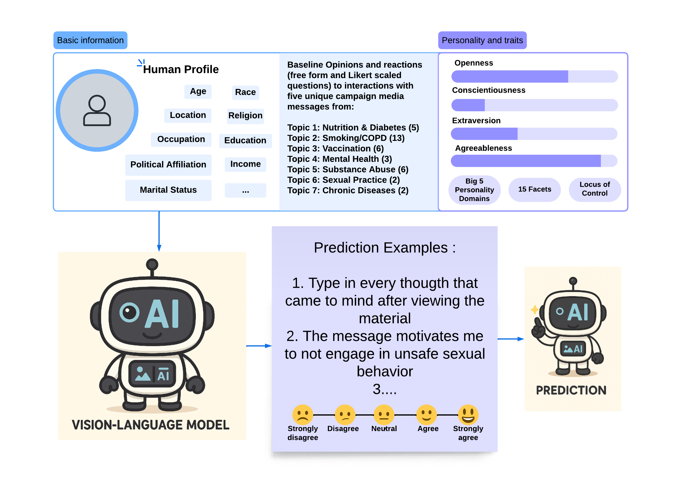

# PHORECAST - Public Health Outreach REceptivity and CAmpaign Signal Tracking


<p align="center">
  
</p>

## Description
This repository contains the PHORECAST dataset alongside the code for our paper. 

PHORECAST maps demographics and personalities into their corresponding reactions to public health marketing campagins.

## Code Details

We consider there to be three phases to the codebase for this project: 
1. Data Processing: We provide the methods used to create our training/validation set in `./processing`:
    - Please use `data_prep.py` to prepare the training/validation splits. Feel free to experiment with the randomization of features and what we use for training.   
    - 

2. Training scripts are found under `./training_scripts`
    - We use the Unsloth library for training. The script support Pixtral, Gemma, Llama, Llava, and Qwen. If you want to start training, run the following command: ```./train.sh gemma {path_to_dataset} {path_to_output}```
    
3. All evaluation scripts are found under `./eval`

